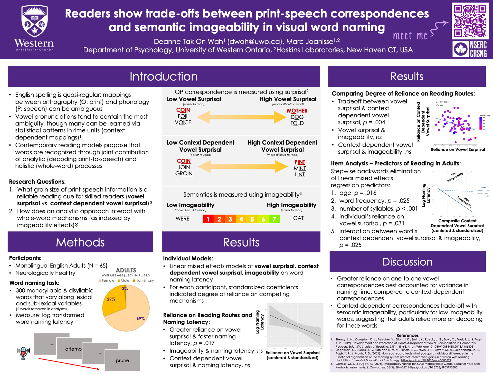

Next week at the Psychonomic Society 2023 conference in San Francisco, I will be presenting a poster on how readers show trade-offs between print-speech correspondences and semantic imageability during visual word naming.

Have a look at the poster and let me know if you have any questions! Happy to answer.

Download the high quality version of the poster [here](../assets/images/Psychonomics 2023_DeanneFINAL.pdf).

