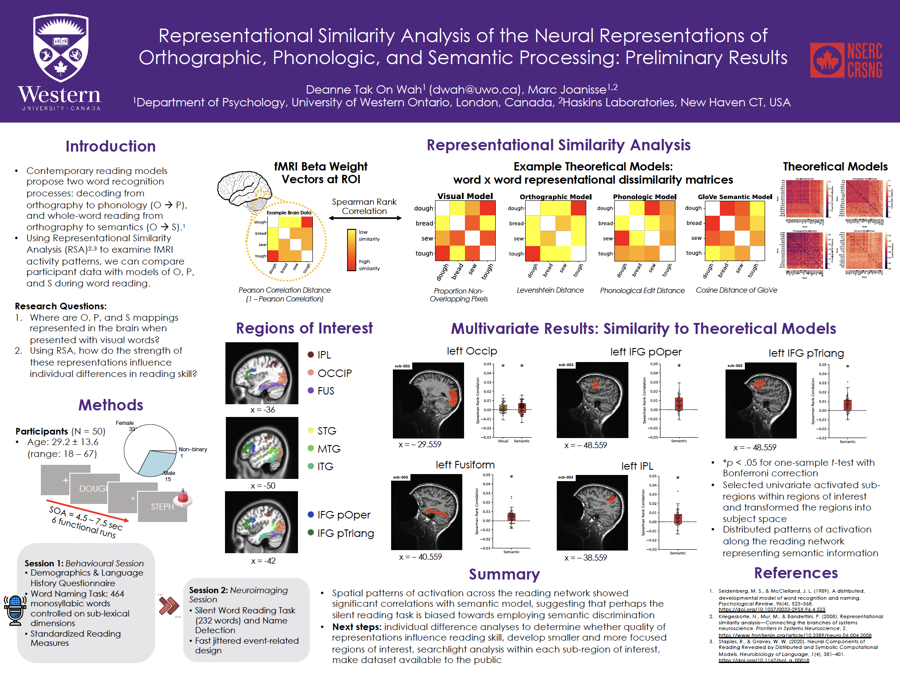

At the Cognitive Neuroscience Society 2024 meeting in Toronto, I presented some preliminary results for my study using Representational Similarity Analysis to investigate the neural representations of visual, orthographic, phonologic, and semantic information during single word reading.

Download the high quality version of the poster [here](../assets/images/CNS_Poster_Apr2024.pdf).

