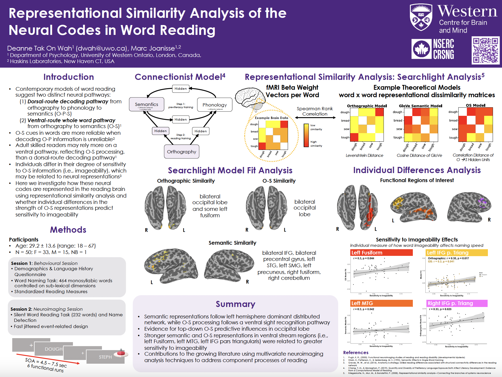

I'll be heading off to Niagara to present at the Lake Ontario Visionary Establishment conference very soon! I will be presenting my project on the Representational Similarity Analysis of the Neural Codes of Word Reading. This project has had multiple iterations and many different analysis steps. I'm happy to be able to share this with you, now that it is near completion.

Download the high quality version of the poster [here](../assets/images/LOVE_Poster_Feb2025_3.pdf).
