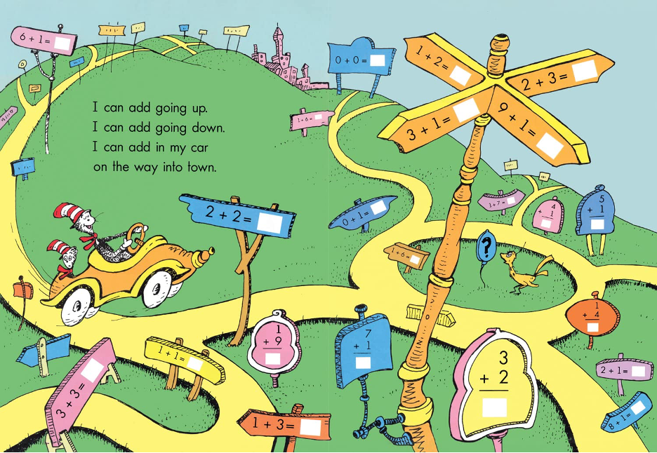

I recently published an article with The Dorsal Column, a neuroscience communication journal started up at Western University. I'm very proud of this piece! \

The article is titled [When Math Meets Dr. Seuss: Our Brain’s Shared System for Mathematics and Language](https://songsuwo.ca/thedorsalcolumn/vol7-iss1-deanne-wah). Did you know the extent to which math and language are linked? This articles explores just that!

